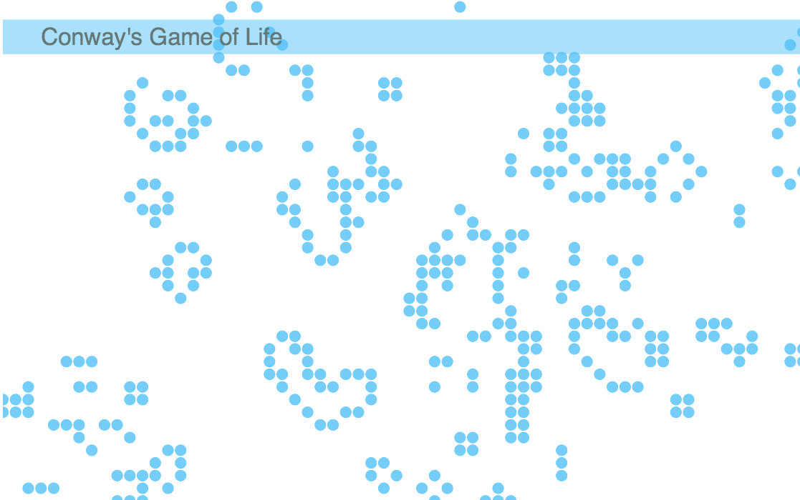

# Jen learns javascript

I wanted to start tackling some basic javascript.  I'm sure the code I've written probably looks terrible to anybody who knows what they are doing in js, but I was pleased that I was able to implement my prettified version of Conway's Game of Life using HTML5 canvas and a few dozen lines.

