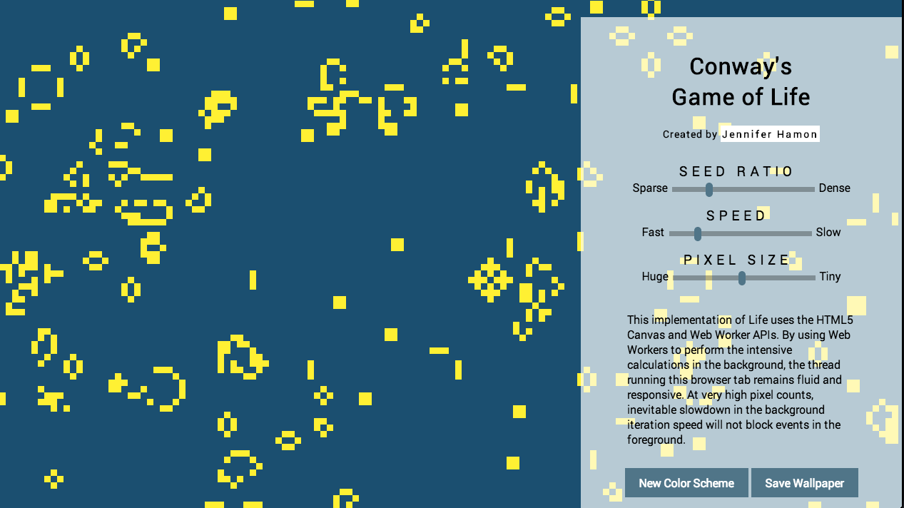

# Conway's Game of Life

[Play with it live on the web here](http://www.hamon.io/conway.js/conway.html)

## Tech Inventory

- Vanilla javascript OOP
- HTML5 Canvas for drawing
- HTML5 Web Workers for heavy lifting on calculations
- jQuery for form interactions

## Description

Conway's Game of Life holds a special place in my heart.  The first non-trivial program I ever wrote was a simple version of the game implemented in Python, and when I decided to learn Javascript I started here.  It makes a great code kata because it is relatively quick and easy to get a basic version going, but also leaves a lot of room for experimentation and improvement.

I've now done this several times in javascript, each time learning something new.  My first implementation was to learn basic JS syntax, and the HTML5 canvas API, but the code was terrible by my current standards. A second implementation improved on my seperation of concerns between view rendering and game calculations.  My third implementation was to learn more about event-driven programming with Backbone.js; in the Backbone version, each cell was represented as a backbone model listening for changes in all its neighbors and cell views rerendered when the model they were watching changed state. 

Though by no means "fast" compared to other implementations (see the memoized [HashLife](http://en.wikipedia.org/wiki/Hashlife) algorithm to have your mind blown), this represents my best and most recent iteration on Life. It makes use of HTML5 Web Workers, provides a user control panel to play with parameters, and implements several algorithmic improvements over my previous attempts.  

Instead of visiting every cell once per iteration, I now keep track of a "change list".  Since the only thing that can change a node's status is the death or resurrection of a neighbor, maintaining a list of changed nodes allows me to skip time consuming neighbor counting on cells that were not neighboring a changed cell.  This is a huge savings after the first few chaotic iterations.

Using web workers was a natural evolution.  Now all the calculations are handled in a background thread and I no longer worry about crashing the tab while testing the limits of how small I can go on the pixel size.

